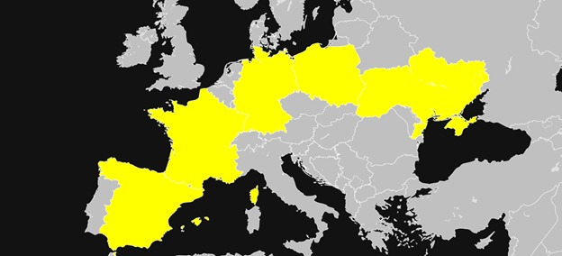
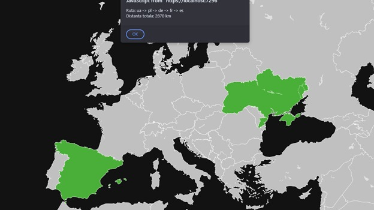
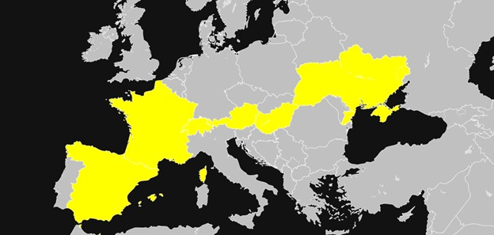
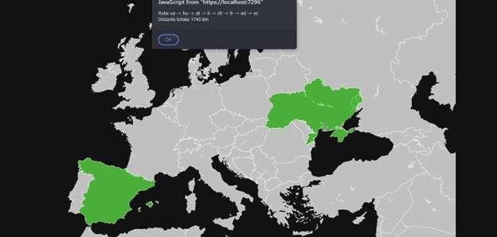

# Informed vs Non-informed Algorithms: Shortest Path in Europe

## 📂 Data Representation

In the JSON file the countries are grouped and the distance between each country is represented by the distance between each capital.

Example JSON structure:

```json
{
  "from": "rs",
  "to": "bg",
  "distance": 373
},
{
  "from": "rs",
  "to": "hu",
  "distance": 380
},
...
```

## 🤖 Algorithms Implemented

### 🔄 Breadth-First Search (BFS) – Uninformed Search

BFS explores all possible routes uniformly and returns the path with the **fewest number of countries / cities**, regardless of distance.




**How It Works:**

* Uses a **queue** to manage paths to explore.
* Dequeues the first path and checks if the destination is reached.
* If not, it **expands all neighboring cities** and adds them to the queue.
* Uses a `visited` set to avoid cycles.
* When the country is found, returns the path and **number of steps**.

**Execution Time:** \~1 ms

---

### ⚖️ Uniform Cost Search (UCS) – Informed Search

UCS is a variant of Dijkstra's algorithm that uses **heuristics** to guide the search efficiently.





**How It Works:**

* Uses a priority queue (**openSet**) ordered by `f(n) = g(n) + h(n)`:

  * `g(n)` = actual cost from start to current node.
  * `h(n)` = estimated cost to destination (heuristic).
* Always expands the **path with lowest total cost**.
* Updates distances and paths as better routes are found.
* Stops when destination is reached.

**Execution Time:** \~11 ms

**Heuristics** used in UCS estimate the remaining distance from current country to the destination based on approximate travel costs.

---

## 📊 Comparison: BFS vs UCS

| Feature              | BFS                       | Uniform Cost Search        |
| -------------------- | ------------------------- | -------------------------- |
| Search Type          | Uninformed                | Informed                   |
| Optimality           | Shortest in nodes         | Shortest in distance       |
| Uses Distance        | ❌ No                      | ✅ Yes                      |
| Speed (in test case) | ⏱1 ms                    | ⏱11 ms                    |
| Path Accuracy        | May not be shortest in km | Always finds shortest path |

**Conclusion:** While BFS is fast and easy to implement, UCS is significantly more efficient for finding realistic shortest paths based on distances.

---

> 📄 Note: The entire European capital map and adjacency data were modeled and stored using a structured JSON file and the user SVG is from Wikipedia: https://en.wikipedia.org/wiki/File:Europe_Map.svg
